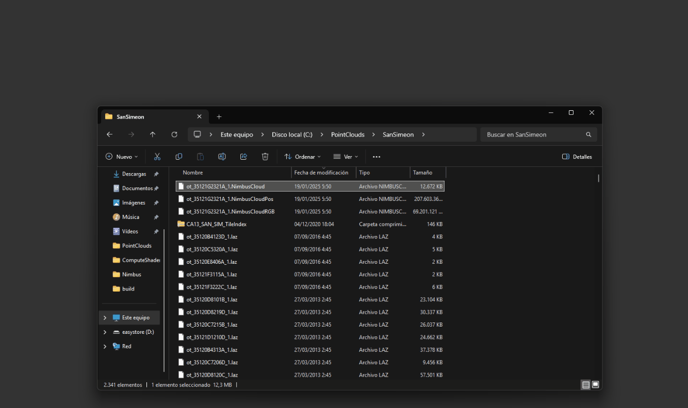
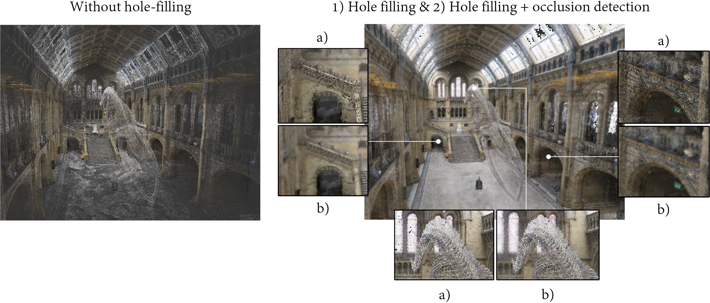
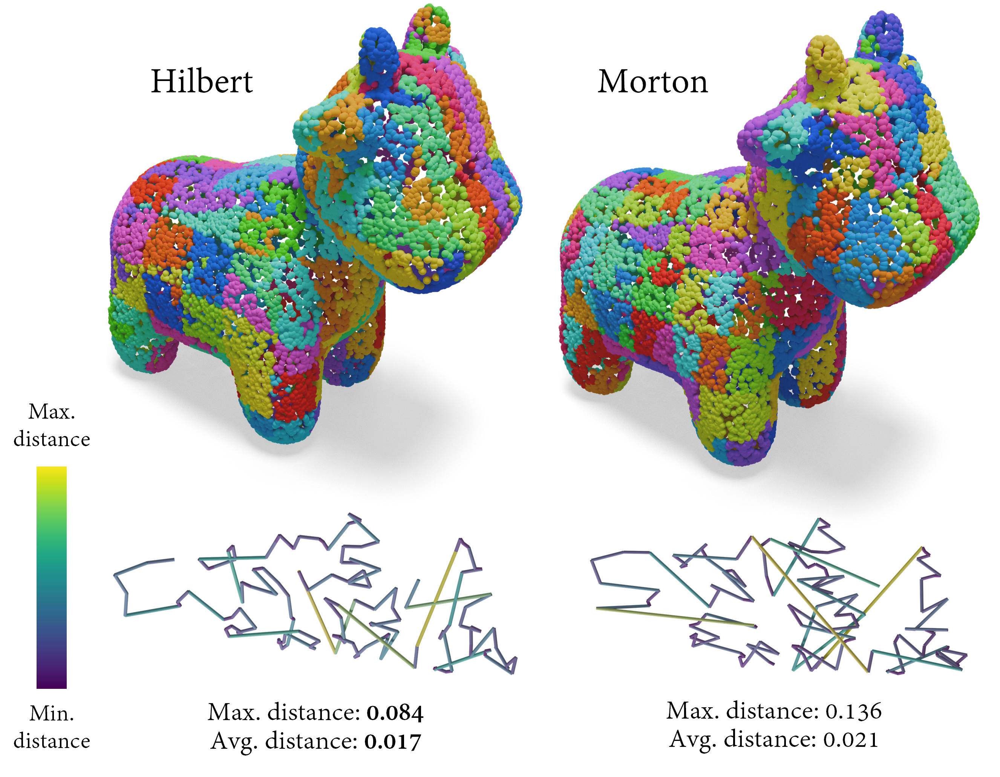

# Virtualized Point Cloud Rendering

 

## About

This repository contains the source code for the paper 'Virtualized Point Cloud Rendering', published in the IEEE Transactions on Graphics and Visualization journal. Our paper is inspired by the previous work of the Rendering and Modelling (TU Wien) research group. Their work, and the foundation of ours, is the rasterisation of point clouds using compute shaders instead of vertex and fragment shaders. However, one of the remaining drawbacks of this approach is that the point cloud must entirely fit in the GPU VRAM. While some computers have a large video memory, commodity hardware typically oscillates between 6 and 12 GB. 

In this work, we transfer point cloud data from disk to CPU and GPU as required. Therefore, we avoid having all the data in VRAM at once, hence the *virtualized point cloud rendering*. Points are only transferred as visibility changes, i.e., points get in the camera's frustum culling and the selected *Level of Detail* includes them.

    

## Features

The main feature of this project is the virtualisation of point cloud data. However, some of the drawbacks of previous work remain even with virtualisation. For instance, point clouds that do not entirely fit into the VRAM must be subsampled via a Level of Detail (LoD) system. The LoD is a tradeoff between performance and not providing visual cues of missing points. Besides this, we also use a fast hole-filling algorithm that fills gaps as long as there is at least one non-empty pixel in a 3x3 neighbourhood (which can be changed). We also offer occlusion checks that help to clean point clouds with several overlapping surfaces, as illustrated in the following image.

    

Additionally, we propose another aggregation of points into meshlets (coined pointlets in our paper) using Hilbert encoding rather than Morton. While not perfect, it mitigates the spatial jumps reported in Morton. Note that a large pointlet is less likely to be discarded during frustum culling, and therefore, we would project points into our viewport even though they are not visible. 

    

## Building

- Clone the repository.
- Go to `Project scripts` and execute the setup file for Windows O.S.
- Compile the project with Visual Studio 2022 after opening `Nimbus.sln`.
- We use [vcpkg](https://github.com/microsoft/vcpkg) as a dependency manager. Make sure it is installed and integrated with Visual Studio to automatically download and compile dependencies.

> [!CAUTION]
> This repository was tested only over Windows O.S.

## How to cite

    @article{Collado_2025,
      author={Collado, José A. and López, Alfonso and Jurado, Juan M. and Jiménez, J. Roberto},
      journal={IEEE Transactions on Visualization and Computer Graphics}, 
      title={Virtualized Point Cloud Rendering}, 
      year={2025},
      volume={},
      number={},
      pages={1-14},
      keywords={GPU-Driven;GPGPU;Point cloud rendering;Out-of-core rendering;Dynamic rendering;Virtual memory system;Level of detail;Acceleration structures;Rasterization;Visibility;Point-based models},
      doi={10.1109/TVCG.2025.3562696}
      }

